# AirDig アーキテクチャ図集

このディレクトリには、AirDig の各種アーキテクチャ図が Mermaid 形式で含まれています。

## 📊 図の一覧

### [System Architecture](./system-architecture.md)
**AirDig 全体システムアーキテクチャ**

- 4つの Pillar（SkyGraph, DeepDrift, TraceCore, PulseSight）
- AirDig Engine（統合グラフレイヤー）
- UI レイヤー
- データソース

### [Data Flow](./data-flow.md)
**データフロー図とイベント駆動アーキテクチャ**

- データ収集からUI表示までの流れ
- イベント駆動アーキテクチャ（Kafka/NATS）
- リアルタイム更新フロー
- データ統合フロー

### [SkyGraph Architecture](./skygraph-architecture.md)
**SkyGraph 内部アーキテクチャ**

- スキャナーオーケストレーター
- AWS/GCP/Kubernetes スキャナー
- グラフビルダーとエッジ推論
- 並列スキャン実行モデル

### [Deployment Architecture](./deployment-architecture.md)
**デプロイメントアーキテクチャ**

- Kubernetes デプロイメント
- Docker Compose 構成（開発環境）
- ネットワークフロー
- スケーリング戦略
- 高可用性構成

---

## 🎨 図の表示方法

### GitHub で表示
GitHub は Mermaid をネイティブサポートしているため、各 Markdown ファイルを開くだけで図が表示されます。

### ローカルで表示

#### VS Code
[Markdown Preview Mermaid Support](https://marketplace.visualstudio.com/items?itemName=bierner.markdown-mermaid) 拡張機能をインストール

#### IntelliJ IDEA / WebStorm
Mermaid プラグインをインストール

#### コマンドライン
```bash
# Mermaid CLI をインストール
npm install -g @mermaid-js/mermaid-cli

# PNG に変換
mmdc -i system-architecture.md -o system-architecture.png
```

### オンラインエディタ
- [Mermaid Live Editor](https://mermaid.live/) - コードをコピペして編集・プレビュー

---

## 📝 図の編集方法

### Mermaid 構文

各図は Mermaid の構文で記述されています：

```markdown
# タイトル

## セクション

\`\`\`mermaid
graph TB
    A[ノード A] --> B[ノード B]
    B --> C{条件}
    C -->|Yes| D[ノード D]
    C -->|No| E[ノード E]
\`\`\`
```

### 主な図のタイプ

- **graph TB/LR** - フローチャート（Top to Bottom / Left to Right）
- **sequenceDiagram** - シーケンス図
- **classDiagram** - クラス図
- **stateDiagram** - ステートマシン図

### スタイリング

```mermaid
graph TB
    A[ノード]
    style A fill:#e8f5e9
```



---

## 🔗 関連ドキュメント

- [Architecture Document](../architecture.md) - 詳細なアーキテクチャ説明
- [Vision Document](../vision.md) - プロジェクトのビジョン
- [Roadmap](../roadmap.md) - 開発ロードマップ

---

## 📋 図の更新ガイドライン

新しい図を追加する場合：

1. 適切な名前でファイルを作成（例：`new-diagram.md`）
2. このREADME に追加
3. `docs/architecture.md` にリンクを追加
4. コミットメッセージに `[docs]` プレフィックスを付ける

例：
```bash
git add docs/diagrams/new-diagram.md
git commit -m "[docs] Add new architecture diagram for X feature"
```

---

**Last Updated:** 2024-12-10
