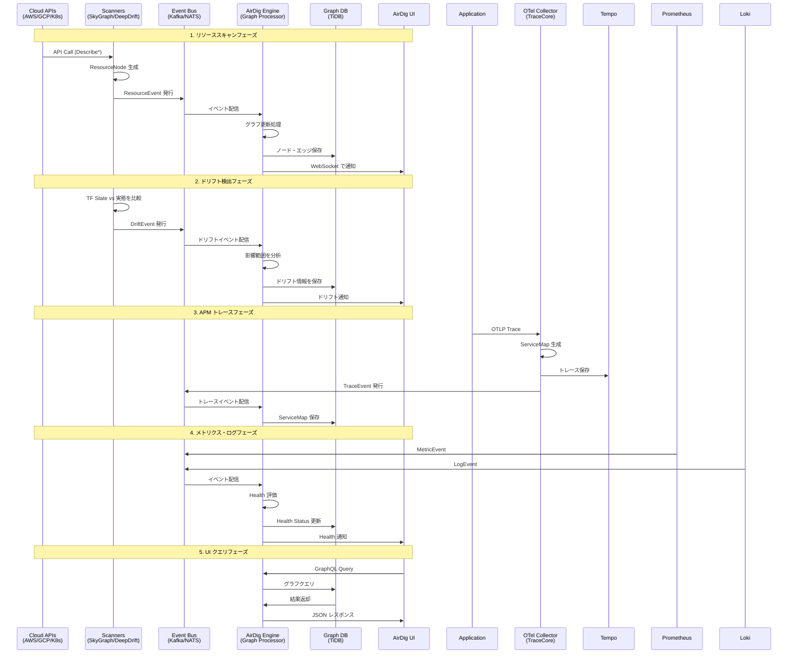
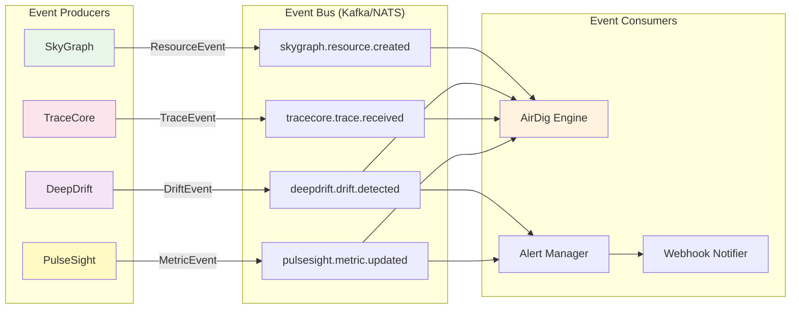
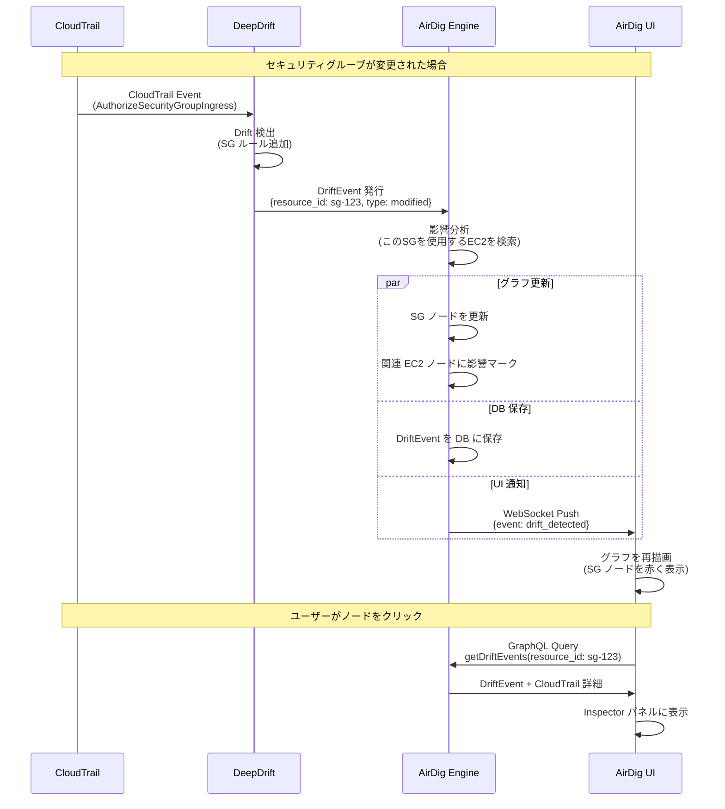
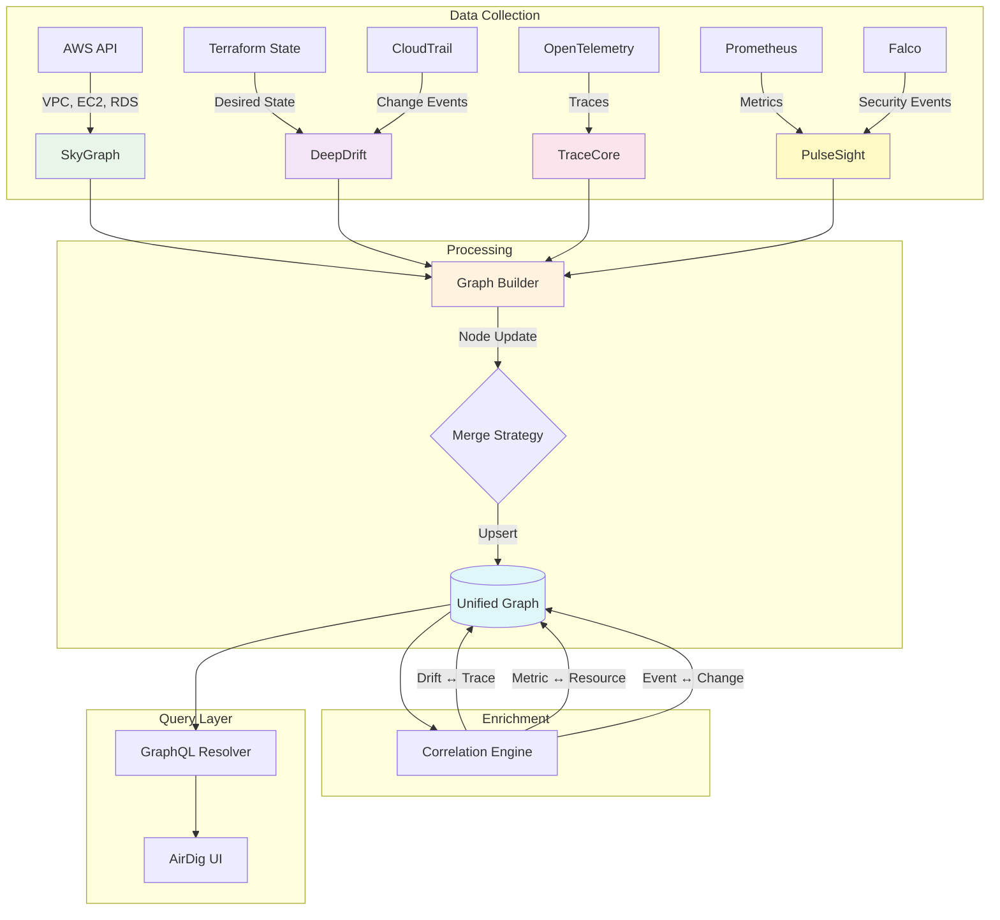

# AirDig データフロー図

## データフロー全体像

```mermaid
sequenceDiagram
    participant Cloud as Cloud APIs<br/>(AWS/GCP/K8s)
    participant Scanner as Scanners<br/>(SkyGraph/DeepDrift)
    participant EventBus as Event Bus<br/>(Kafka/NATS)
    participant Engine as AirDig Engine<br/>(Graph Processor)
    participant DB as Graph DB<br/>(TiDB)
    participant UI as AirDig UI

    Note over Cloud,UI: 1. リソーススキャンフェーズ

    Cloud->>Scanner: API Call (Describe*)
    Scanner->>Scanner: ResourceNode 生成
    Scanner->>EventBus: ResourceEvent 発行
    EventBus->>Engine: イベント配信
    Engine->>Engine: グラフ更新処理
    Engine->>DB: ノード・エッジ保存
    Engine->>UI: WebSocket で通知

    Note over Cloud,UI: 2. ドリフト検出フェーズ

    Scanner->>Scanner: TF State vs 実態を比較
    Scanner->>EventBus: DriftEvent 発行
    EventBus->>Engine: ドリフトイベント配信
    Engine->>Engine: 影響範囲を分析
    Engine->>DB: ドリフト情報を保存
    Engine->>UI: ドリフト通知

    Note over Cloud,UI: 3. APM トレースフェーズ

    participant App as Application
    participant OTel as OTel Collector<br/>(TraceCore)
    participant Tempo as Tempo

    App->>OTel: OTLP Trace
    OTel->>OTel: ServiceMap 生成
    OTel->>Tempo: トレース保存
    OTel->>EventBus: TraceEvent 発行
    EventBus->>Engine: トレースイベント配信
    Engine->>DB: ServiceMap 保存

    Note over Cloud,UI: 4. メトリクス・ログフェーズ

    participant Prom as Prometheus
    participant Loki as Loki

    Prom->>EventBus: MetricEvent
    Loki->>EventBus: LogEvent
    EventBus->>Engine: イベント配信
    Engine->>Engine: Health 評価
    Engine->>DB: Health Status 更新
    Engine->>UI: Health 通知

    Note over Cloud,UI: 5. UI クエリフェーズ

    UI->>Engine: GraphQL Query
    Engine->>DB: グラフクエリ
    DB->>Engine: 結果返却
    Engine->>UI: JSON レスポンス
```

## イベント駆動アーキテクチャ

```mermaid
graph LR
    subgraph "Event Producers"
        Sky[SkyGraph]
        Drift[DeepDrift]
        Trace[TraceCore]
        Pulse[PulseSight]
    end

    subgraph "Event Bus (Kafka/NATS)"
        Topic1[skygraph.resource.created]
        Topic2[deepdrift.drift.detected]
        Topic3[tracecore.trace.received]
        Topic4[pulsesight.metric.updated]
    end

    subgraph "Event Consumers"
        Engine[AirDig Engine]
        Alert[Alert Manager]
        Webhook[Webhook Notifier]
    end

    Sky -->|ResourceEvent| Topic1
    Drift -->|DriftEvent| Topic2
    Trace -->|TraceEvent| Topic3
    Pulse -->|MetricEvent| Topic4

    Topic1 --> Engine
    Topic2 --> Engine
    Topic3 --> Engine
    Topic4 --> Engine

    Topic2 --> Alert
    Topic4 --> Alert

    Alert --> Webhook

    style Sky fill:#e8f5e9
    style Drift fill:#f3e5f5
    style Trace fill:#fce4ec
    style Pulse fill:#fff9c4
    style Engine fill:#fff3e0
```

## リアルタイム更新フロー

```mermaid
sequenceDiagram
    participant CT as CloudTrail
    participant Drift as DeepDrift
    participant Engine as AirDig Engine
    participant UI as AirDig UI

    Note over CT,UI: セキュリティグループが変更された場合

    CT->>Drift: CloudTrail Event<br/>(AuthorizeSecurityGroupIngress)
    Drift->>Drift: Drift 検出<br/>(SG ルール追加)
    Drift->>Engine: DriftEvent 発行<br/>{resource_id: sg-123, type: modified}

    Engine->>Engine: 影響分析<br/>(このSGを使用するEC2を検索)

    par グラフ更新
        Engine->>Engine: SG ノードを更新
        Engine->>Engine: 関連 EC2 ノードに影響マーク
    and DB 保存
        Engine->>Engine: DriftEvent を DB に保存
    and UI 通知
        Engine->>UI: WebSocket Push<br/>{event: drift_detected}
    end

    UI->>UI: グラフを再描画<br/>(SG ノードを赤く表示)

    Note over CT,UI: ユーザーがノードをクリック

    UI->>Engine: GraphQL Query<br/>getDriftEvents(resource_id: sg-123)
    Engine->>UI: DriftEvent + CloudTrail 詳細
    UI->>UI: Inspector パネルに表示
```

## データ統合フロー

```mermaid
graph TD
    subgraph "Data Collection"
        A[AWS API] -->|VPC, EC2, RDS| S[SkyGraph]
        B[Terraform State] -->|Desired State| D[DeepDrift]
        C[CloudTrail] -->|Change Events| D
        E[OpenTelemetry] -->|Traces| T[TraceCore]
        F[Prometheus] -->|Metrics| P[PulseSight]
        G[Falco] -->|Security Events| P
    end

    subgraph "Processing"
        S --> M[Graph Builder]
        D --> M
        T --> M
        P --> M

        M -->|Node Update| N{Merge Strategy}
        N -->|Upsert| DB[(Unified Graph)]
    end

    subgraph "Enrichment"
        DB --> R[Correlation Engine]
        R -->|Drift ↔ Trace| DB
        R -->|Metric ↔ Resource| DB
        R -->|Event ↔ Change| DB
    end

    subgraph "Query Layer"
        DB --> Q[GraphQL Resolver]
        Q --> UI[AirDig UI]
    end

    style S fill:#e8f5e9
    style D fill:#f3e5f5
    style T fill:#fce4ec
    style P fill:#fff9c4
    style M fill:#fff3e0
    style DB fill:#e0f7fa
```
