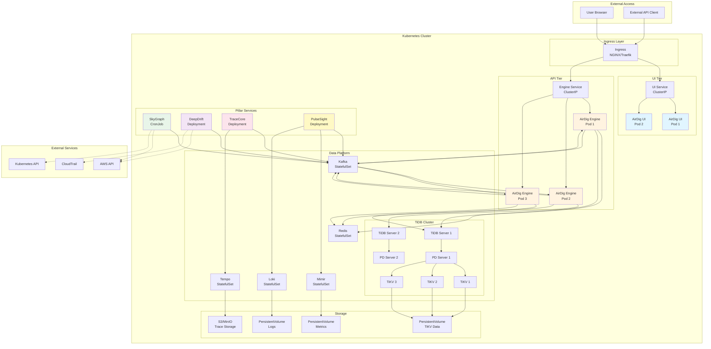
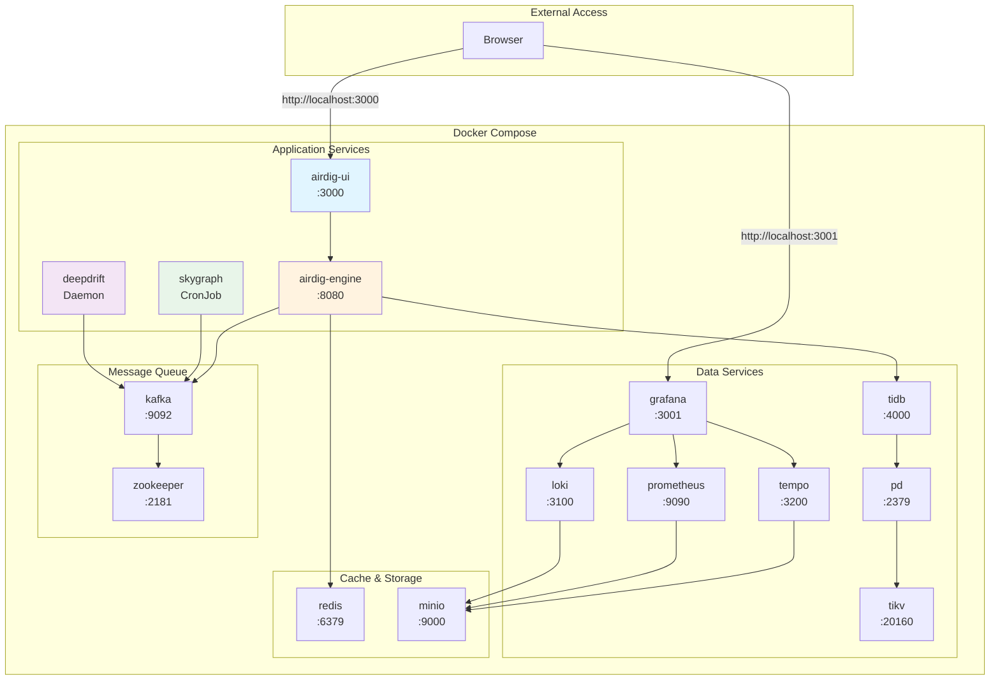
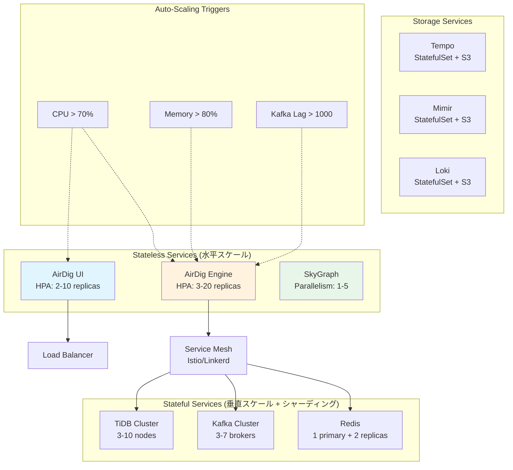
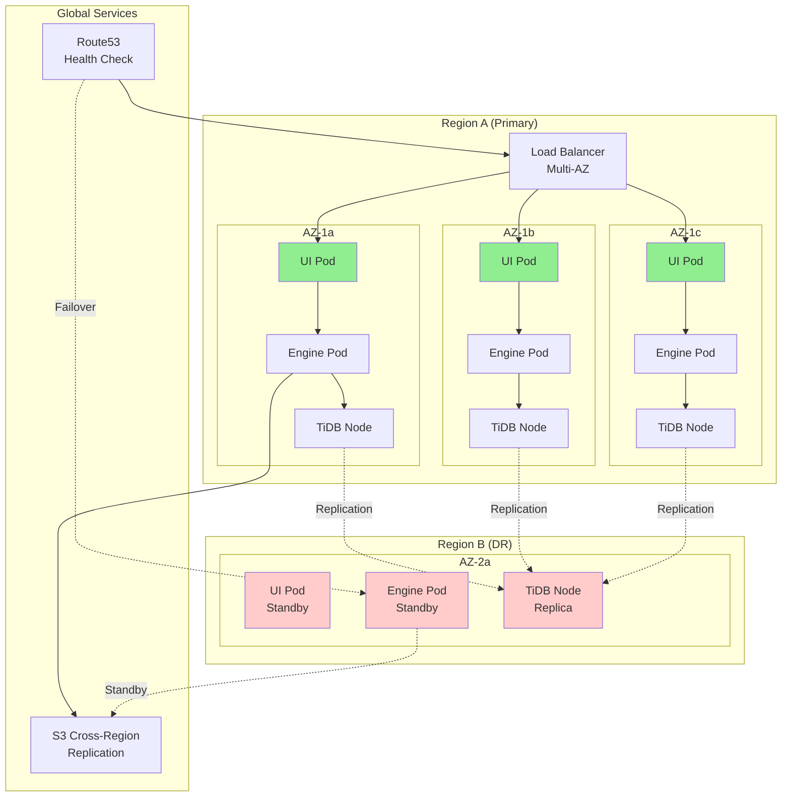

# AirDig デプロイメントアーキテクチャ

## Kubernetes デプロイメント



## ネットワークフロー

```mermaid
graph LR
    subgraph "External"
        Internet[Internet]
    end

    subgraph "Load Balancer"
        LB[Load Balancer<br/>AWS ALB/ELB]
    end

    subgraph "Kubernetes"
        subgraph "Ingress"
            Ingress[Ingress Controller]
        end

        subgraph "Services"
            UISvc[UI Service<br/>:3000]
            EngineSvc[Engine Service<br/>:8080]
        end

        subgraph "Pods"
            UI[UI Pods]
            Engine[Engine Pods]
        end
    end

    subgraph "Data Layer"
        TiDB[(TiDB<br/>:4000)]
        Redis[(Redis<br/>:6379)]
        Kafka[(Kafka<br/>:9092)]
    end

    Internet -->|HTTPS| LB
    LB -->|HTTP| Ingress

    Ingress -->|/| UISvc
    Ingress -->|/api/*| EngineSvc
    Ingress -->|/graphql| EngineSvc

    UISvc --> UI
    EngineSvc --> Engine

    Engine --> TiDB
    Engine --> Redis
    Engine --> Kafka

    UI -.GraphQL.-> Engine

    style Internet fill:#ffebee
    style LB fill:#e3f2fd
    style Ingress fill:#f3e5f5
    style Engine fill:#fff3e0
    style TiDB fill:#e0f7fa
```

## Docker Compose 構成（開発環境）



## スケーリング戦略



## 高可用性構成


