# SkyGraph アーキテクチャ図

## SkyGraph 内部アーキテクチャ

```mermaid
graph TB
    subgraph "CLI Interface"
        CLI[skygraph CLI]
        Config[Configuration<br/>skygraph.yaml]
    end

    subgraph "Scanner Orchestrator"
        Orch[Scanner Orchestrator]
        Auth[Authentication Manager]
        Queue[Task Queue]
    end

    subgraph "Cloud Scanners"
        subgraph "AWS Scanner"
            AWSVPC[VPC Scanner]
            AWSSubnet[Subnet Scanner]
            AWSSG[Security Group Scanner]
            AWSEC2[EC2 Scanner]
            AWSRDS[RDS Scanner]
            AWSLambda[Lambda Scanner<br/>🔴 v0.2.0]
            AWSS3[S3 Scanner<br/>🔴 v0.2.0]
        end

        subgraph "Kubernetes Scanner 🔴 v0.2.0"
            K8sPod[Pod Scanner]
            K8sSvc[Service Scanner]
            K8sDeploy[Deployment Scanner]
        end

        subgraph "GCP Scanner 🔴 v0.3.0"
            GCPCompute[Compute Scanner]
            GCPVPC[VPC Scanner]
        end
    end

    subgraph "Graph Builder"
        Builder[Graph Builder]
        NodeMerge[Node Merger<br/>重複排除]
        EdgeInfer[Edge Inference<br/>依存関係推論]
    end

    subgraph "Storage Layer"
        JSON[JSON Exporter]
        TiDB[(TiDB<br/>🔴 v0.2.0)]
        ClickHouse[(ClickHouse<br/>🔴 v0.2.0)]
    end

    CLI --> Config
    CLI --> Orch

    Orch --> Auth
    Orch --> Queue

    Queue -.並列実行.-> AWSVPC
    Queue -.並列実行.-> AWSSubnet
    Queue -.並列実行.-> AWSSG
    Queue -.並列実行.-> AWSEC2
    Queue -.並列実行.-> AWSRDS

    AWSVPC --> Builder
    AWSSubnet --> Builder
    AWSSG --> Builder
    AWSEC2 --> Builder
    AWSRDS --> Builder

    Builder --> NodeMerge
    NodeMerge --> EdgeInfer

    EdgeInfer --> JSON
    EdgeInfer --> TiDB
    EdgeInfer --> ClickHouse

    style AWSVPC fill:#90ee90
    style AWSSubnet fill:#90ee90
    style AWSSG fill:#90ee90
    style AWSEC2 fill:#90ee90
    style AWSRDS fill:#90ee90
    style AWSLambda fill:#ffcccb
    style AWSS3 fill:#ffcccb
```



## スキャンフロー（AWS EC2 の例）

```mermaid
sequenceDiagram
    participant CLI
    participant Orch as Orchestrator
    participant EC2 as EC2 Scanner
    participant AWS as AWS API
    participant Builder as Graph Builder

    CLI->>Orch: scan --provider aws
    Orch->>Orch: 認証情報ロード
    Orch->>EC2: Scan()

    Note over EC2,AWS: API リクエスト

    EC2->>AWS: DescribeInstances()
    AWS->>EC2: []Instance

    Note over EC2: ResourceNode 変換

    loop 各インスタンス
        EC2->>EC2: convertToResourceNode()
        Note over EC2: {<br/>  id: "aws:ec2:i-123",<br/>  type: "ec2",<br/>  metadata: {...}<br/>}
    end

    EC2->>Builder: []ResourceNode

    Builder->>Builder: 重複チェック
    Builder->>Builder: ノード追加

    Note over Builder: エッジ推論開始

    Builder->>Builder: inferEdgesForNode()
    Note over Builder: subnet_id から<br/>Subnet → EC2 エッジ生成

    Builder->>Builder: security_groups から<br/>SG → EC2 エッジ生成

    Builder->>CLI: Graph 完成
    CLI->>CLI: JSON エクスポート
```



## エッジ推論ロジック

```mermaid
graph TD
    Start[ノードスキャン完了] --> Loop{全ノードを走査}

    Loop -->|VPC| VPC[VPC<br/>推論なし]
    Loop -->|Subnet| Subnet[Subnet]
    Loop -->|SG| SG[Security Group]
    Loop -->|EC2| EC2[EC2 Instance]
    Loop -->|RDS| RDS[RDS Instance]

    Subnet --> SubnetEdge{vpc_id<br/>存在？}
    SubnetEdge -->|Yes| SubnetVPC[VPC → Subnet<br/>ownership エッジ]
    SubnetEdge -->|No| Continue

    SG --> SGEdge{vpc_id<br/>存在？}
    SGEdge -->|Yes| SGVPC[VPC → SG<br/>ownership エッジ]
    SGEdge -->|No| Continue

    EC2 --> EC2Subnet{subnet_id<br/>存在？}
    EC2Subnet -->|Yes| EC2SubnetEdge[Subnet → EC2<br/>network エッジ]
    EC2Subnet -->|No| EC2SG

    EC2 --> EC2SG{security_groups<br/>存在？}
    EC2SG -->|Yes| EC2SGEdge[SG → EC2<br/>network エッジ]
    EC2SG -->|No| Continue

    RDS --> RDSSubnet{subnet_ids<br/>存在？}
    RDSSubnet -->|Yes| RDSSubnetEdge[Subnet → RDS<br/>network エッジ]
    RDSSubnet -->|No| RDSSG

    RDS --> RDSSG{security_groups<br/>存在？}
    RDSSG -->|Yes| RDSSGEdge[SG → RDS<br/>network エッジ]
    RDSSG -->|No| RDSDep

    RDS --> RDSDep{同じVPC内の<br/>EC2存在？}
    RDSDep -->|Yes| RDSDepEdge[EC2 → RDS<br/>dependency エッジ]
    RDSDep -->|No| Continue

    SubnetVPC --> Continue[次のノード]
    SGVPC --> Continue
    EC2SubnetEdge --> Continue
    EC2SGEdge --> Continue
    RDSSubnetEdge --> Continue
    RDSSGEdge --> Continue
    RDSDepEdge --> Continue
    VPC --> Continue

    Continue --> Loop

    Loop -->|完了| End[グラフ構築完了]

    style EC2 fill:#lightblue
    style RDS fill:#lightgreen
    style Subnet fill:#lightyellow
    style SG fill:#lightpink
```



## 並列スキャン実行モデル

```mermaid
graph LR
    subgraph "Main Goroutine"
        Main[Main Thread]
    end

    subgraph "Scanner Goroutines"
        G1[VPC Scanner<br/>Goroutine]
        G2[Subnet Scanner<br/>Goroutine]
        G3[SG Scanner<br/>Goroutine]
        G4[EC2 Scanner<br/>Goroutine]
        G5[RDS Scanner<br/>Goroutine]
    end

    subgraph "Result Channel"
        Chan[Channel<br/>[]ResourceNode]
    end

    subgraph "AWS API"
        API[AWS API<br/>Rate Limit: 共有]
    end

    Main -.spawn.-> G1
    Main -.spawn.-> G2
    Main -.spawn.-> G3
    Main -.spawn.-> G4
    Main -.spawn.-> G5

    G1 -.API Call.-> API
    G2 -.API Call.-> API
    G3 -.API Call.-> API
    G4 -.API Call.-> API
    G5 -.API Call.-> API

    API -.Result.-> G1
    API -.Result.-> G2
    API -.Result.-> G3
    API -.Result.-> G4
    API -.Result.-> G5

    G1 -->|Send| Chan
    G2 -->|Send| Chan
    G3 -->|Send| Chan
    G4 -->|Send| Chan
    G5 -->|Send| Chan

    Chan -->|Collect| Main

    Main --> Result[Graph Builder]

    style G1 fill:#e8f5e9
    style G2 fill:#e8f5e9
    style G3 fill:#e8f5e9
    style G4 fill:#e8f5e9
    style G5 fill:#e8f5e9
```

## グラフデータモデル

```mermaid
classDiagram
    class Graph {
        +[]ResourceNode Nodes
        +[]Edge Edges
        +AddNode(node ResourceNode)
        +AddEdge(edge Edge)
        +FindNode(id string) *ResourceNode
        +FindEdges(nodeID string) []Edge
    }

    class ResourceNode {
        +string ID
        +string Type
        +string Provider
        +string Region
        +string Name
        +map[string]any Metadata
        +map[string]string Tags
        +time.Time CreatedAt
        +time.Time UpdatedAt
    }

    class Edge {
        +string From
        +string To
        +string Type
        +float64 Weight
        +map[string]any Metadata
    }

    Graph "1" *-- "many" ResourceNode
    Graph "1" *-- "many" Edge
    Edge "many" --> "1" ResourceNode : From
    Edge "many" --> "1" ResourceNode : To

    note for ResourceNode "例:\n- aws:ec2:i-123456\n- aws:vpc:vpc-789012\n- k8s:pod:frontend-7d8f9"

    note for Edge "Type:\n- ownership (VPC → Subnet)\n- network (Subnet → EC2)\n- dependency (EC2 → RDS)\n- call (Service A → Service B)\n- drift (TFDrift)"
```


