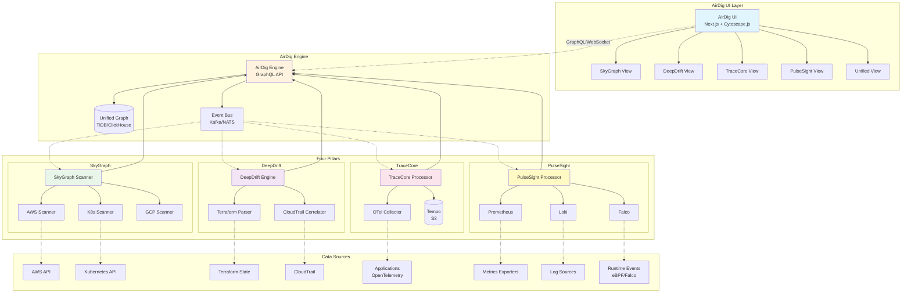

# AirDig システムアーキテクチャ図

## 全体システムアーキテクチャ

## コンポーネント説明

### UI Layer
- **AirDig UI**: Next.js ベースの Web UI
- **5つのビュー**: 各 Pillar ごとのビュー + 統合ビュー

### AirDig Engine
- **GraphQL API**: クライアントからのクエリを処理
- **Unified Graph DB**: 全データを統合したグラフデータベース
- **Event Bus**: 非同期イベント配信

### Four Pillars
- **SkyGraph**: クラウドリソース構成をスキャン
- **DeepDrift**: IaC と実態の差分を検出
- **TraceCore**: アプリケーショントレースを収集
- **PulseSight**: メトリクス、ログ、ランタイムイベントを収集

### Data Sources
- クラウド API、Kubernetes、Terraform、CloudTrail
- OpenTelemetry instrumented アプリ
- Prometheus exporters、Loki logs、Falco events
